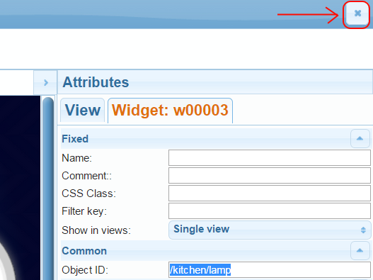
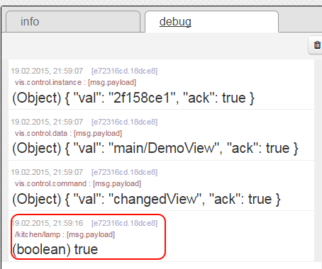

This project adds web visualisation to Node-RED. It is based on [ioBroker.vis](https://github.com/ioBroker/ioBroker.vis).

Functionality
-------------
 We introduce "vis in" node which creates the visualisation server with communication via socket.io.

Install
-------

```bash
cd $NODE_RED_HOME
npm install node-red-vis
```

Usage
--------

Create "advanced => vis in" node and 3 inject nodes as pictured:


Deploy it. After deploying go to [http://localhost:1880/vis/edit.html](http://localhost:1880/vis/edit.html) and create "basic - ctrl Bulb on/off":


and "RGraph - Gauge-Basic":


Write into Object ID of "basic - ctrl Bulb on/off" - "/kitchen/lamp":


and into Object ID of "RGraph - Gauge-Basic" - "/balkon/temperature":


Wait for the project saved (about 3 seconds) and after that click here:



You will see something like this:


If you click on lamp following payload will be sent:



You can forward this message to your hardware to control it.


